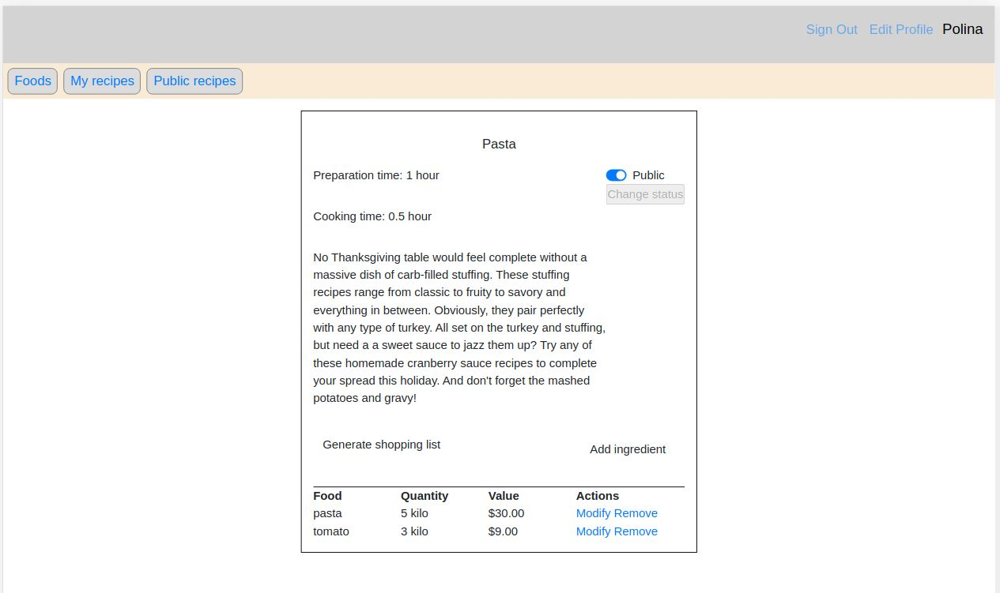
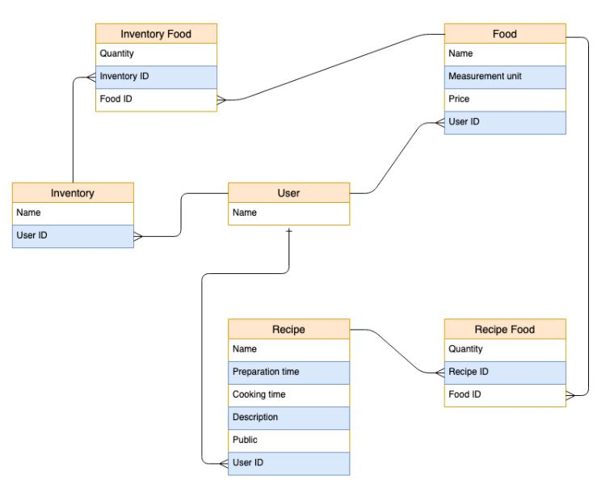

# Recipe-app:

Classic recipe website



## Description:

The Recipe app keeps track of all your recipes, ingredients, and inventory. It will allow you to save ingredients, keep track of what you have, create recipes, and generate a shopping list based on what you have and what you are missing from a recipe. Also, since sharing recipes is an important part of cooking the app allows you to make them public so anyone can access them.

## Live Link

[Heroku](https://whispering-dusk-07468.herokuapp.com/users/sign_in)

## Built With

- Ruby
- Ruby on Rails
- PostgreSQL

## Entity Relationship Diagram



## Getting Started

To get a local copy up and running follow these simple example steps.

## Instructions

```
$ cd <folder>
```

```
$ git clone git@github.com:PolinaStamenova/recipe-app.git
```

```
$ cd recipe-app
```

## Install

```
$ bundle install
```

## Run

```
$ rails db:create
```

```
$ rails db:migrate
```

```
$ rails db:seed
```

## Usage:

To log in as admin use the following:

```
email: admin@mail.com
password: 123456
```

## Authors

## 🤝 Contributing

Contributions, issues, and feature requests are welcome!

Feel free to check the [issues page](https://github.com/PolinaStamenova/recipe-app/issues).

## Show your support

Give a ⭐️ if you like this project!

## Acknowledgments

- Microverse
